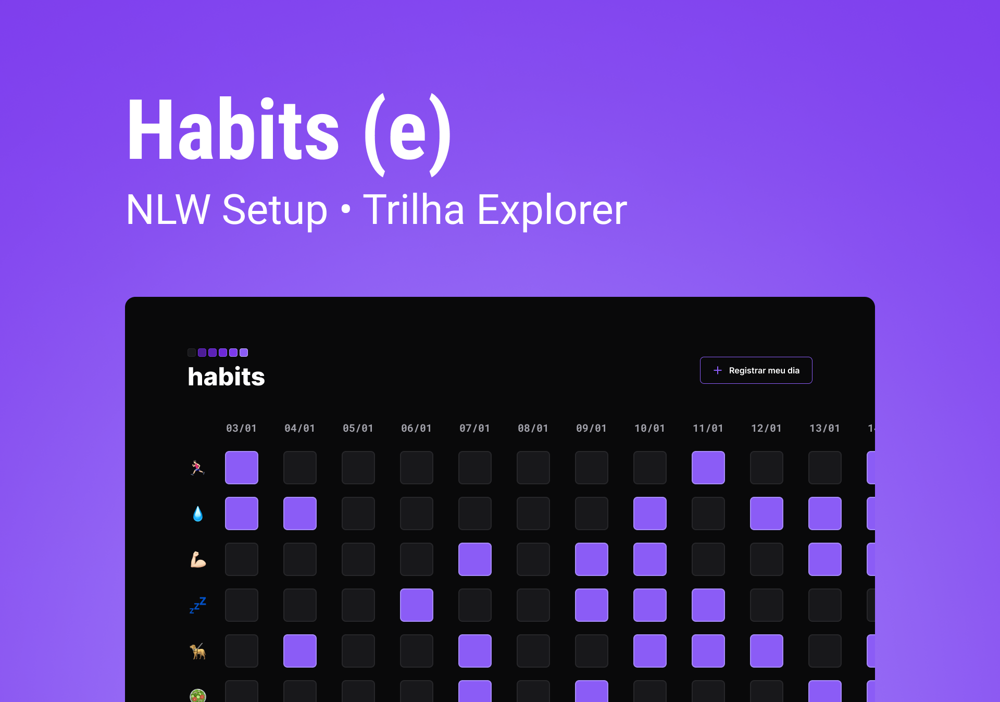

<h1 align=center>HABITS<h1>

Projeto feito pela RocketSeat para o treinamento e aprendizado de novos devs. 
 

## <strong>🧠TECNOLOGIAS<strong>

 Este projeto foi desenvolvido com as seguintes tecnologias:

- HTML E CSS
- JavaScript
- Git e GitHub
- Figma

## 📲<STRONG>PROJETO<STRONG>

O Habits tem o objetivo de ajudar o usuario a localizar e organizar seus hábitos diarios.

- [Visite o projeto online][def]

## <strong>📑LAYOUT<strong>

Você pode acessar o layout no figma através [DESSE LINK](https://www.figma.com/community/file/1195327109778210238). Para sua visualização é necessario ter conta no [Figma](https://www.figma.com/).

[def]: https://kauanespindula.github.io/NLW-Setup-Habits/
